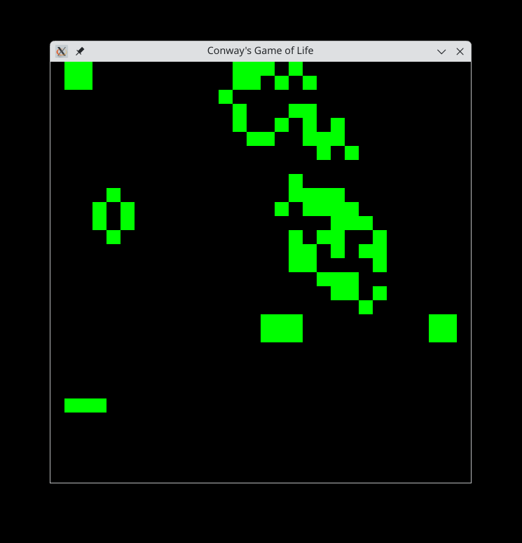

# Conway's Game of Life

An implementation of Conway's Game of Life in C.

Licensed under the 3-Clause BSD License.

The starting state is hardcoded as the ["Acorn" pattern](https://commons.wikimedia.org/wiki/File:Game_of_life_acorn.svg).

